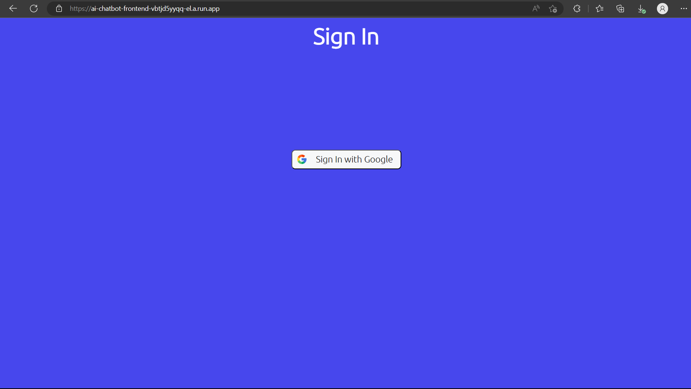
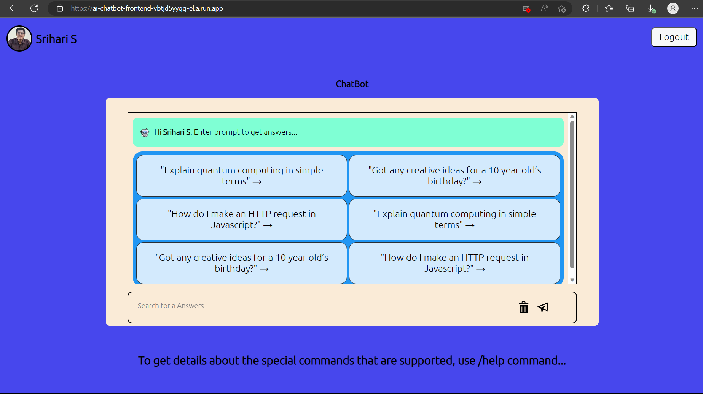
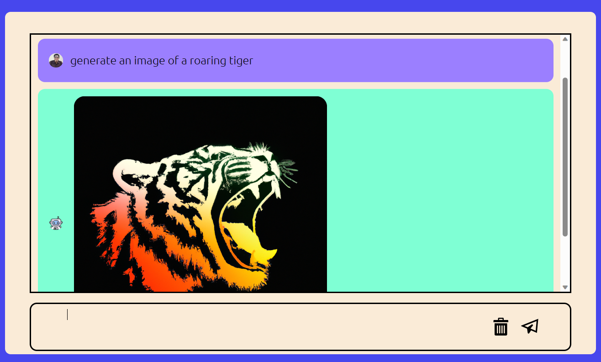
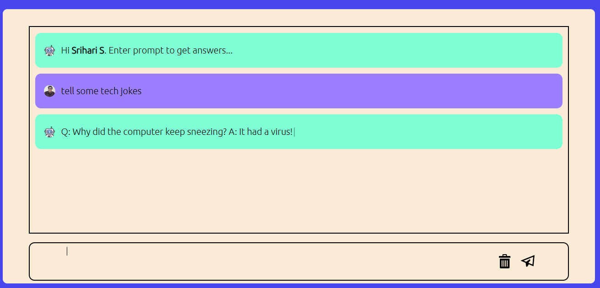
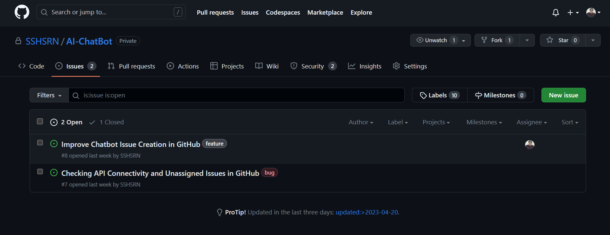

# AI Chatbot
## Introduction
This project is an AI chatbot that can answer questions about anything. Be it a simple math doubt or a very complex question about the universe, this chatbot can answer it all. It uses the <strong>OpenAI GPT-3.5</strong> API for generating textual responses and <strong>Dall-E</strong> API to generate images.<br>One of the main features of this chatbot is that it can determine if the user is asking for an image or a text and accordingly, the API call is made.

## How to use
1. If you just want to test out the chatbot, you can go to the [website](https://ai-chatbot-frontend-vbtjd5yyqq-el.a.run.app/) and check it out.
2. If you want to run it locally, use the following commands:
```bash
git clone https://github.com/SSHSRN/AI-ChatBot.git
cd AI-ChatBot
cd backend
npm install
cd ..
cd frontend
npm install
```
* Now that the dependencies are installed, the next step is to set up the API keys. To set the environment variables, create a .env file in the backend folder and use the following format:
```bash
OPENAI_API_KEY=<your_openai_api_key>
PERSONAL_ACCESS_TOKEN=<your_github_personal_access_token>
```
* Now, to run the application, use the `npm start` command from the frontend folder. This will start the frontend server on port 3000.
* If you want to containerize the application and then run it with Docker, use the following commands:
```bash
docker compose build
docker compose up
```

## Screenshots
* Login Page<br>

* Chatbot Page<br>

* Image Generation<br>

* Text Generation<br>

* Github API Integration<br>


## Tech Stack
* ReactJS
* NodeJS
* ExpressJS
* Docker
* OpenAI GPT-3.5
* Dall-E
* Github API

## Contribution Guidelines
* If you want to contribute to this project, you can fork the repository, get an issue assigned to you and then make a pull request.
* A simpler way to create an issue is to use the `/feedback` prompt on the [website](https://ai-chatbot-frontend-vbtjd5yyqq-el.a.run.app/).

## Contact
For any queries, you can contact me [here](https://www.linkedin.com/in/sshsrn/)